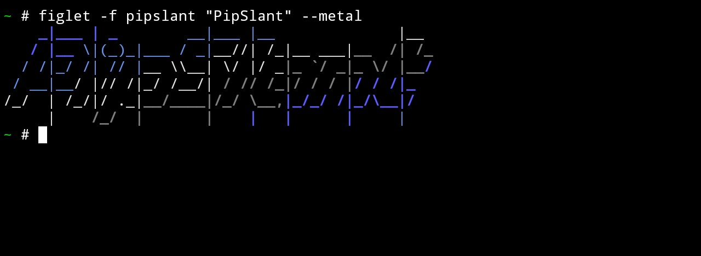
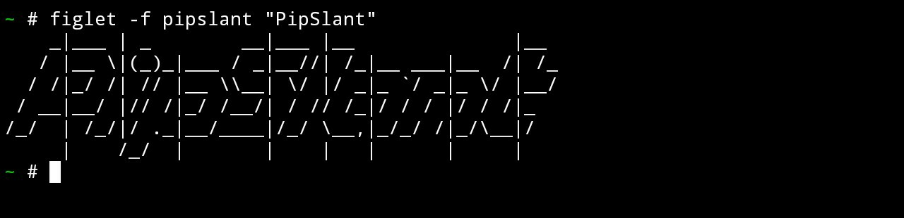

<h1>PipSlant font file for Figlet</h1>
<br>

```bash
figlet -f pipslant "PipSlant" --metal
```

<center></center>

<br>

```bash
figlet -f pipslant "PipSlant" 
```

<center></center>
<h3>
Installtion 
</h3>

```bash
git clone https://github.com/aymensecurity/pipslant.git
cd pipslant
bash install.sh
```
